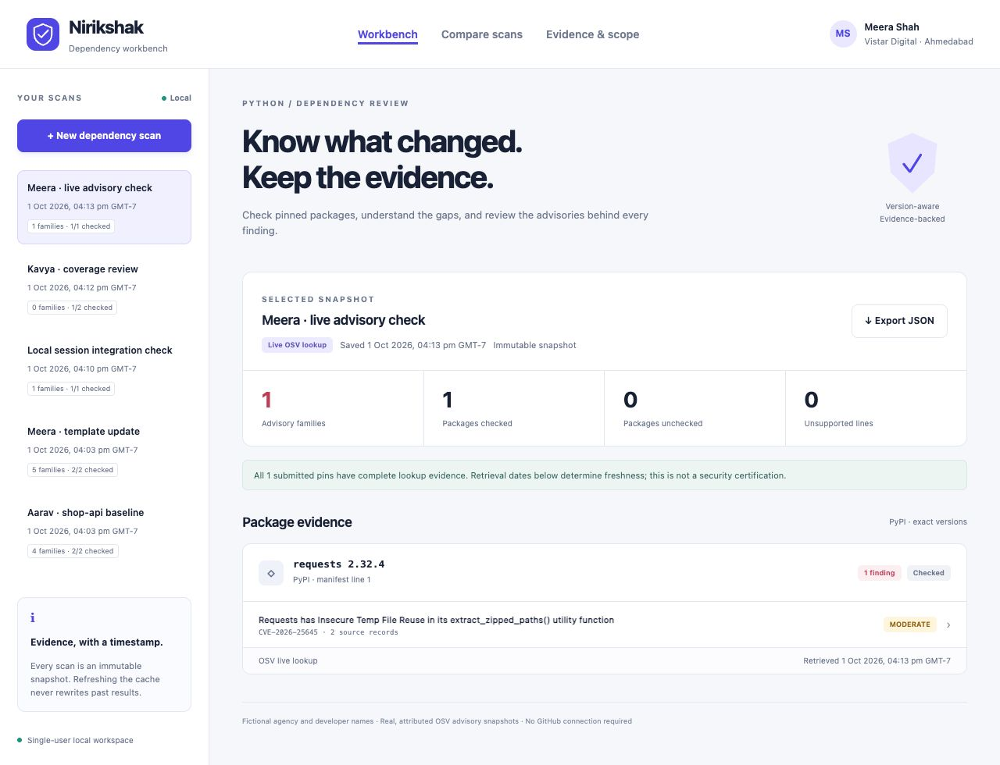
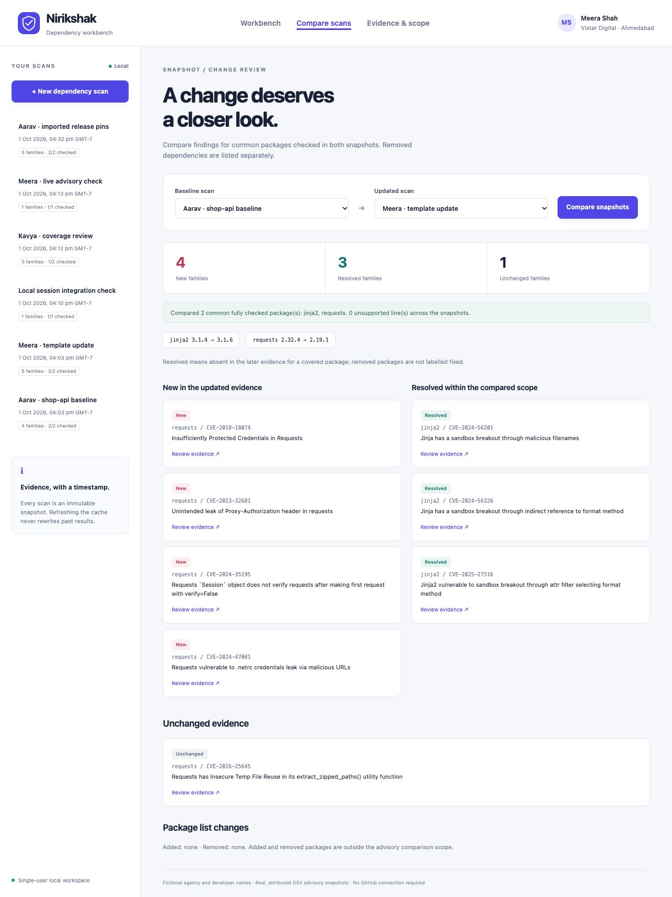

# Nirikshak — Dependency Risk Workbench

A Flask security project for reviewing pinned Python dependencies with
traceable OSV evidence. Save an immutable scan, inspect the advisories and
their retrieval dates, then compare a dependency update without mistaking
missing evidence or package removal for a fixed vulnerability.

The fictional workspace belongs to **Vistar Digital, Ahmedabad**, with demo
reviews by **Aarav Patel** and **Meera Shah**. The interface uses a light slate
and indigo theme. Agency, people and manifests are fictional; advisory data
comes from original, attributed OSV responses.



## What the app does

- Parses up to 30 exact `package==version` pins from pasted or uploaded UTF-8
  `.txt` files, without running pip, installing packages or executing input.
- Checks exact package versions against a persistent local cache by default.
  Uncached versions stay **unverified**.
- Offers an explicitly approved live OSV lookup. Only normalised PyPI package
  names and versions go to `api.osv.dev`; scan names and manifest text stay local.
- Shows source links, CVE/GHSA identities, upstream severity, fixed-version
  markers, lookup completeness and per-package retrieval times.
- Groups aliased source records into advisory families to avoid double counting
  one CVE represented in multiple databases.
- Preserves scan history even after later live queries refresh the cache.
- Compares new, resolved and unchanged families for common packages with
  complete lookup evidence on both sides. Lists added/removed packages separately.
- Exports the complete scan, manifest and evidence as downloadable JSON.



## Run locally

Use **Python 3.10–3.12**. Development and tests were run with Python 3.12.14.
No API key, Node installation, external database or GitHub login is required.

From this project's folder:

```bash
python3 -m venv .venv
source .venv/bin/activate
python -m pip install -r requirements.txt
python app.py
```

Open **http://127.0.0.1:8108/**. The server binds to localhost with debug mode
disabled. Stop it with Ctrl+C.

On Windows, create the environment with `python -m venv .venv`, activate using
`.venv\Scripts\Activate.ps1` in PowerShell, then run the same pip/app commands.

For the exact tested dependency versions, including test tools:

```bash
python -m pip install -r requirements-lock.txt
```

Alternative port and separate data directory:

```bash
python app.py --port 8118 --data-dir instance/review-empty --no-demo
```

`--no-demo` creates no sample scans. It still loads the four original bundled
OSV cache entries so a new workspace can demonstrate offline lookups.
Choose a new data directory for a fresh demo; keep your existing directory
to preserve scans. Starting the app does not erase existing data.

## Five-minute demo

1. Open the seeded **Aarav · shop-api baseline** snapshot. It has two checked
   packages and four advisory families across the captured evidence.
2. Expand a finding, inspect its source IDs and follow **Original OSV record**.
   Severity and fixed-version markers are upstream metadata.
3. Open **Compare scans** and compare baseline with **Meera · template update**.
   The captured responses demonstrate **4 new, 3 resolved and 1 unchanged**
   family. The fictional update fixes the Jinja2 matches while downgrading
   requests and introducing further matches.
4. Create a new offline scan containing `unfamiliar-package==1.0`. The package
   remains unverified; a zero finding count is accompanied by a coverage warning.
5. Add a range such as `Flask>=3.1` or a nested file directive such as
   `-r other.txt`. The line is explicitly unsupported and is never followed.
6. Optionally choose **Live · query OSV now**, confirm the package/version upload,
   and save. A failed or incomplete lookup is recorded with its coverage gap.
7. Export JSON and inspect the immutable report, source dates and manifest hash.

### Accepted manifest example

```text
# Comments and blank lines are allowed
Jinja2==3.1.4
requests==2.32.4  # Inline comments following whitespace are allowed
```

Scope is deliberately narrow. Range specifiers, extras, environment markers,
editable installs, local build versions, URL dependencies, hashes, pip options
and nested requirement files are flagged. Package names are normalised;
versions are validated using PEP 440. Duplicate pins are flagged; conflicting
versions make the package evidence partial and exclude it from comparisons.

## Evidence and freshness

The shipped dataset contains complete original responses for:

| Package | Version | Source records | Alias-grouped families |
| --- | --- | ---: | ---: |
| jinja2 | 3.1.4 | 6 | 3 |
| jinja2 | 3.1.6 | 0 | 0 |
| requests | 2.32.4 | 2 | 1 |
| requests | 2.19.1 | 10 | 5 |

These are **1 October 2026 UTC snapshots**, not current vulnerability counts.
Every original response includes its retrieval timestamp in
[demo/osv-snapshots.json](demo/osv-snapshots.json).

OSV aggregates original GitHub Advisory Database and PyPI Advisory Database
records. The included advisory data is **CC BY 4.0**, separately from this
application's MIT license. Original references, descriptions, IDs and credits
are retained. See [data attribution](demo/NOTICE.md),
[OSV data sources](https://google.github.io/osv.dev/data/) and the
[CC BY 4.0 license](https://creativecommons.org/licenses/by/4.0/).

Cached results remain usable after 24 hours but are labelled **stale**. Their
original date is never replaced by the scan creation time. Missing/invalid
retrieval dates and incomplete OSV pagination produce partial coverage.
"No known findings" means no active matching records in a completed retrieval
snapshot; it is not a security guarantee.

Live lookups use the documented
[OSV batch endpoint](https://google.github.io/osv.dev/post-v1-querybatch/), which
returns IDs, followed by bounded detail requests to `/v1/vulns/{id}`. A failed
live refresh leaves older cache entries intact and does not silently substitute
them into a supposedly current scan.

## Test and validation

```bash
python -m pip install -r requirements-dev.txt
python -m pytest --cov=desk --cov-report=term-missing -q
python -m pip check
```

**108 tests pass; 99% statement coverage.** Tests are deterministic and offline,
using isolated temporary databases and mocked OSV responses. They cover parser
attacks and limits, malformed and missing evidence, request protection, uploads,
cache freshness, failed refreshes, immutable scans, consent, concurrent lookup
exclusion and correctly scoped comparisons.

A separate real OSV client smoke check retrieved the expected original records
for two public package/version pairs. Full validation details are in
[docs/EVALUATION.md](docs/EVALUATION.md). The GitHub Actions workflow is prepared
for Python 3.10 and 3.12; it has not run remotely during local development.

## API

| Method | Endpoint | Purpose |
| --- | --- | --- |
| GET | `/api/health` | Local readiness and ecosystem |
| GET | `/api/bootstrap` | Session CSRF token and workspace metadata |
| GET | `/api/scans` | Latest 50 scan summaries |
| POST | `/api/scans` | Create an immutable scan |
| GET | `/api/scans/<id>` | Full report and evidence |
| GET | `/api/scans/<id>/export` | Download JSON |
| GET | `/api/compare?before=<id>&after=<id>` | Scoped finding comparison |

POST JSON: `{"name":"Release review","text":"Jinja2==3.1.4","mode":"offline"}`.
For live mode also send `"live_consent":true`. Mutations require the session
cookie from bootstrap and its `X-CSRF-Token` header. Multipart uploads use a
`manifest` `.txt` file plus `name` and `mode` fields. There is no edit/delete API
for completed scan snapshots.

## Structure

```text
app.py                  Local CLI and Flask server
desk/manifest.py        Non-executing exact-pin parser and input limits
desk/advisories.py      Fixed-host OSV client and advisory summarisation
desk/scanning.py        Coverage, freshness, snapshots and comparisons
desk/storage.py         SQLite scans and separately refreshable cache
desk/demo.py            Original snapshot loading and fictional scan seeding
desk/__init__.py        API, session protection and application factory
desk/templates/         Accessible server-rendered page structure
desk/static/            Responsive CSS, SVG mark and vanilla JavaScript
demo/                   Original manifests, OSV responses and attribution
tests/                  Offline parser/provider/API/comparison regressions
docs/                   Evaluation notes and actual working screenshots
instance/               Ignored database and persistent session key
```

## Limits and deployment assumptions

This is a single-user local portfolio application. It has no account system,
tenant isolation, production job queue or remote deployment configuration.
Use production authentication, TLS and an appropriate WSGI server before
exposing private manifests to other users.

Limits: 32 KiB manifest, 150 lines, 30 supported packages, 64 KiB HTTP request,
200 saved scans per data directory, latest 50 shown, one live lookup at a time
with a five-second cooldown. Live detail retrieval uses a best-effort 18-second
budget, up to 60 detail requests and 100 represented source records per package.
Oversized responses, redirect attempts, budget exhaustion and pagination are
explicit errors or partial evidence.

The scanner checks submitted pins, not transitive dependencies or an installed
environment. It cannot establish runtime reachability or upgrade compatibility.
Source severity is not an application risk assessment, and a removed dependency
is not described as a fixed advisory.

## Local development history

The independent Git repository records actual module-sized development commits:
project skeleton, exact-pin parser, OSV client, scan storage/comparison, original
fixtures, APIs, UI structure, interactions, regression fixes, tests, evaluation,
CI and documentation. No commits are backdated, and no GitHub commands or remote
operations are needed to run this project.

Detailed beginner-oriented design notes are kept outside this repository in the
local `local-design-docs` folder for private review.
